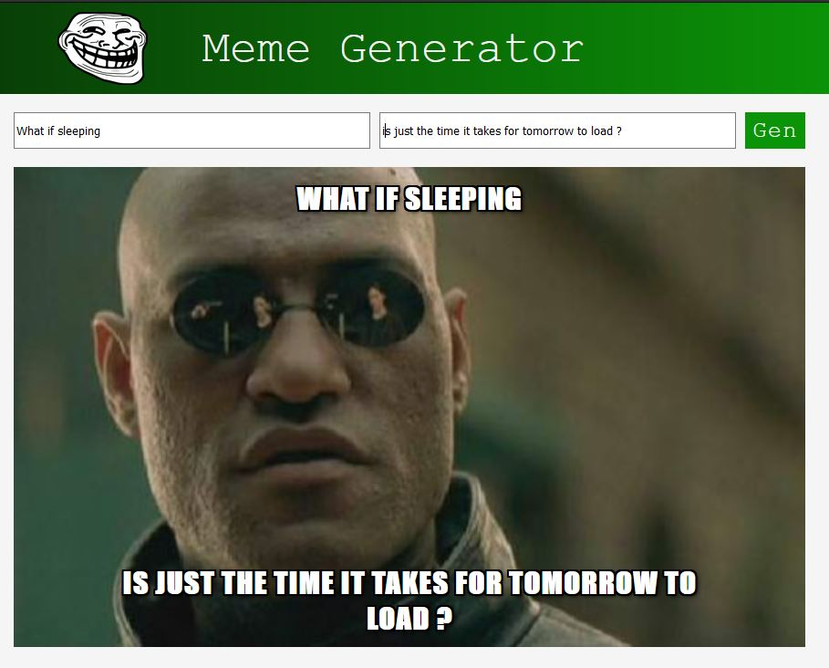

# React Meme Generator 🎭  

A simple meme generator built with **React.js**, allowing users to input custom top and bottom text and generate random meme images using the [Imgflip API](https://api.imgflip.com/get_memes).  
This project was originally developed as part of an assignment for a **Scrimba React course** I completed a few years ago.

---

## 📸 Preview  
  

---

## 🚀 Features  
- **Custom Text**: Add top and bottom captions to memes.  
- **Random Meme Fetching**: Get a random meme from the Imgflip API.  
- **Controlled Inputs**: Real-time updates while typing.  

---

## 🛠️ Tech Stack  
- **React.js** (Functional components & hooks)  
- **JavaScript (ES6+)**  
- **CSS** for styling  
- **Imgflip API** for meme images  

---

## 📋 Project Structure  

### `index.js`  
- Renders the `<App />` component to the DOM.  

### `App.js`  
- Imports and displays the `Header` and `MemeGenerator` components.  

### `Header.js`  
- Displays the app title and logo.  

### `MemeGenerator.js`  
- Manages meme state (top text, bottom text, random image).  
- Fetches memes from the Imgflip API and stores them in `allMemeImgs`.  
- Handles input changes for controlled form fields.  
- Generates a random meme when the **Gen** button is clicked.  

---

## 📚 How It Works  
1. **Initialize State**: Holds `topText`, `bottomText`, and `randomImg` (default: `"http://i.imgflip.com/1bij.jpg"`).  
2. **API Call**: Fetch meme templates from Imgflip and store in state.  
3. **User Input**: Controlled form inputs update state in real time.  
4. **Generate Meme**: On button click, select a random meme from the fetched list.  

---

## 🖥️ Installation & Usage  
```bash
# Clone the repository
git clone https://github.com/yourusername/React-MemeGenerator-project.git

# Install dependencies
npm install

# Run the app
npm start
